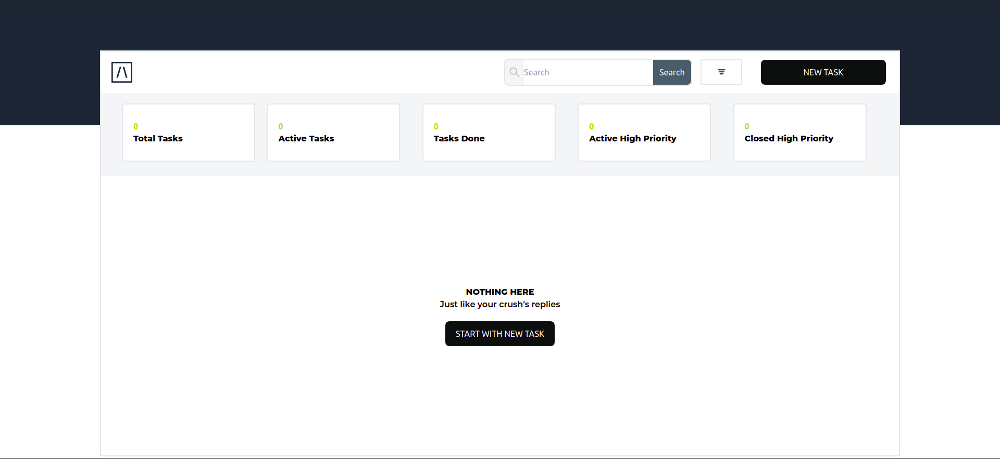
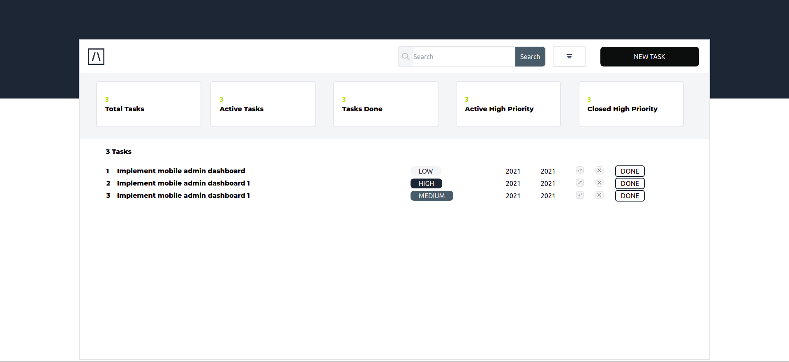

# Task Force Challenge Frontend




## Getting started

These instructions will get you a copy of the project up and running on your local machine for development and testing purposes. See deployment for notes on how to deploy the project on a live system.

### Prerequisites

```
- NodeJS
```

### Installation

```
- git clone `https://github.com/dushimeemma/task-force-challenge-frontend`
- Install dependencies `yarn install`
- Setup dotenv for `Firebase` connection
- Run app `yarn run dev`
- Click new task or start with new task to add new task
- Click on task title to open single task
- Click eye icon to update task
- Click cross icon to delete task
```
